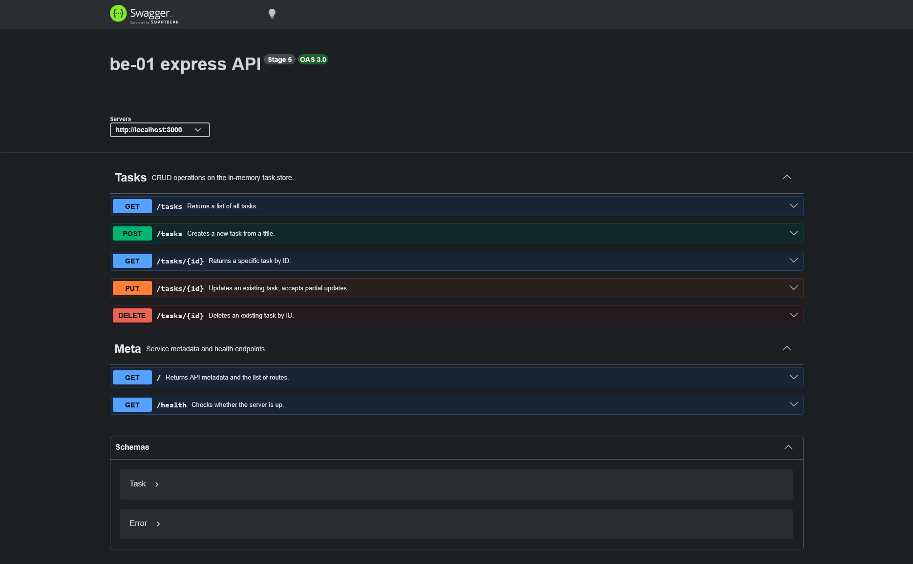

# FlyRank BE-01 Task API

FlyRank internship assignment BE-01 for the Backend AI Engineering track.
An in-memory CRUD API for tasks built on Node.js (ESM) and Express 5.
The store is seeded from `seed.json` at startup and can be restored to that
state with `POST /reset`. Interactive API docs are served with Swagger UI.

## Install and run

```bash
npm install
node index.js
```

The server listens on <http://localhost:3000>.
Swagger UI is at <http://localhost:3000/docs>.

## Endpoints

| Method | Path         | Body                    | Success | Errors                                                                  |
| ------ | ------------ | ----------------------- | ------- | ----------------------------------------------------------------------- |
| GET    | `/`          | –                       | 200     | –                                                                       |
| GET    | `/health`    | –                       | 200     | –                                                                       |
| GET    | `/stats`     | –                       | 200     | –                                                                       |
| GET    | `/tasks`     | –                       | 200     | 400 invalid `done`/`search` query                                       |
| GET    | `/tasks/:id` | –                       | 200     | 400 invalid ID, 404 not found                                           |
| POST   | `/tasks`     | `{ "title": string }`   | 201     | 400 missing/invalid title or `done` supplied, 415 non-JSON content type |
| POST   | `/reset`     | –                       | 200     | –                                                                       |
| PATCH  | `/tasks/:id` | `{ "title"?, "done"? }` | 200     | 400 invalid ID/title/done, 404 not found, 415 non-JSON content type     |
| DELETE | `/tasks/:id` | –                       | 204     | 400 invalid ID, 404 not found                                           |

## Sample output

`GET /tasks`

```json
[
  { "id": 1, "title": "Sample Task A", "done": false },
  { "id": 2, "title": "Sample Task B", "done": true },
  { "id": 3, "title": "Sample Task C", "done": false }
]
```

`GET /stats` (aggregate task counts)

```json
{ "total": 3, "done": 1, "open": 2 }
```

`GET /tasks?done=true` (filter by completion state)

```json
[{ "id": 2, "title": "Sample Task B", "done": true }]
```

`GET /tasks?search=task a` (case-insensitive title substring match)

```json
[{ "id": 1, "title": "Sample Task A", "done": false }]
```

Filters can be combined, e.g. `GET /tasks?done=false&search=sample`. An invalid query value returns:

```json
{ "error": "Invalid done query" }
```

`POST /tasks` with `{"title":"Write README"}` → `201 Created`

```json
{ "id": 4, "title": "Write README", "done": false }
```

`POST /reset` (restores the seed data) → `200 OK`

```json
[
  { "id": 1, "title": "Sample Task A", "done": false },
  { "id": 2, "title": "Sample Task B", "done": true },
  { "id": 3, "title": "Sample Task C", "done": false }
]
```

Validation failures return an error object:

```json
{ "error": "Missing or invalid title" }
```

## Swagger screenshot



## Mortality experiment

Restarting the server caused all tasks created in the previous instance to be lost. This is because the server holds all tasks in-memory and does not write the data to a persistent storage location such as a file or database.

## AI vs me

### 1. What did the AI do better? Do I understand it?

- Its test suite is more thorough and its handlers consider more cases; less likely to find uncaught exceptions, silent failures, or regressions.
- Its modular architecture is more robust and scalable; changes can be targeted without affecting anything else; general-purpose scaffolding make additions simpler.
- I understand the general structure and behavior of the code, but not the specific implementation. It uses syntax, configuration options, and built-in Node packages that I'm unfamiliar with and hence cannot fully verify.

### 2. What did it get wrong or quietly ignore from the prompt?

- It adds hundreds of undocumented tests that are difficult to read and verify.
- Its architecture is overengineered for this context and adds unnecessary overhead.

### 3. What did my prompt fail to specify? What did it decide on its own?

The prompt did not specify:

- the intended level of complexity of the API.
- an exact goal or "done" state.
- what not to include.
- that the tests and its assertions must be documented.
- the exact architecture of the API.

It decided:

- some of the API's behaviors; what's accepted and what isn't.
- the testing mechanism.
- all test cases.
- the wiring of the architecture.
- the granularity of the modules.
