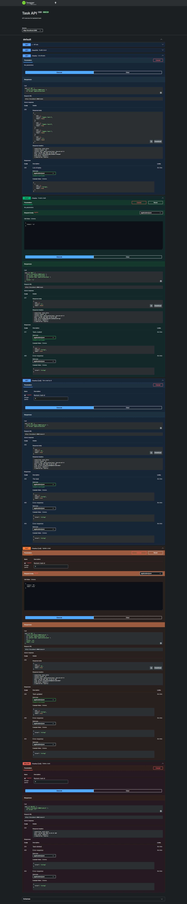

# Task API

A simple task management API exercise for the backend track. Built with [Express 5](https://expressjs.com/) on Node.js, using ES modules. Data is stored in memory and resets whenever the server restarts. An interactive [Swagger UI](http://localhost:3000/docs) is served at `/docs`.

## Requirements

- Node.js 18 or later (tested with v26.3.0)
- npm

## Install

```bash
npm install
```

## Run

Start the server:

```bash
node index.js
```

It listens on `http://localhost:3000`. You should see:

```
Example app listening on port 3000
```

Open the Swagger UI at [http://localhost:3000/docs](http://localhost:3000/docs) to explore and test every endpoint interactively.

### Run the tests

```bash
npm test
```

## Endpoints

| Method | Path          | Description          | Request body                                | Success |
| ------ | ------------- | -------------------- | ------------------------------------------- | ------- |
| GET    | `/`           | API info             | —                                           | 200     |
| GET    | `/health`     | Health check         | —                                           | 200     |
| GET    | `/tasks`      | List all tasks       | —                                           | 200     |
| POST   | `/tasks`      | Create a task        | `{"title": "string"}`                      | 201     |
| GET    | `/tasks/:id`  | Get a task by id     | —                                           | 200     |
| PUT    | `/tasks/:id`  | Update a task        | `{"title": "string", "done": true/false}`  | 200     |
| DELETE | `/tasks/:id`  | Delete a task        | —                                           | 204     |
| GET    | `/docs`       | Swagger UI           | —                                           | 200     |

### Errors

| Status | Meaning                                    |
| ------ | ------------------------------------------ |
| 400    | Invalid ID or malformed request body       |
| 404    | Task or route not found                    |
| 500    | Internal server error                      |

### Examples

Create a task:

```bash
curl -X POST http://localhost:3000/tasks \
  -H "Content-Type: application/json" \
  -d '{"title": "Learn Express"}'
```

Update a task:

```bash
curl -X PUT http://localhost:3000/tasks/1 \
  -H "Content-Type: application/json" \
  -d '{"done": true}'
```

## Sample `curl -i` Output

Fetch a single task:

```bash
curl -i http://localhost:3000/tasks/1
```

```
HTTP/1.1 200 OK
X-Powered-By: Express
Content-Type: application/json; charset=utf-8
Content-Length: 45
ETag: W/"2d-LxnaxqPbKVaCuq7cGk7EOmeDnes"
Date: Tue, 04 Aug 2026 12:49:32 GMT
Connection: keep-alive
Keep-Alive: timeout=5

{"id":1,"title":"Sample Task A","done":false}
```

Create a task:

```bash
curl -i -X POST http://localhost:3000/tasks \
  -H "Content-Type: application/json" \
  -d '{"title": "From README"}'
```

```
HTTP/1.1 201 Created
X-Powered-By: Express
Content-Type: application/json; charset=utf-8
Content-Length: 43
ETag: W/"2b-rMSALgNu961M4eku0AcQ0f+qxik"
Date: Tue, 04 Aug 2026 12:49:32 GMT
Connection: keep-alive
Keep-Alive: timeout=5

{"id":4,"title":"From README","done":false}
```

Validation error (empty title):

```bash
curl -i -X POST http://localhost:3000/tasks \
  -H "Content-Type: application/json" \
  -d '{"title": ""}'
```

```
HTTP/1.1 400 Bad Request
X-Powered-By: Express
Content-Type: application/json; charset=utf-8
Content-Length: 25
ETag: W/"19-5NcYXAVfO/S11Vobg+MEq/ym3ZI"
Date: Tue, 04 Aug 2026 12:49:32 GMT
Connection: keep-alive
Keep-Alive: timeout=5

{"error":"Missing title"}
```

## Swagger UI

Open [http://localhost:3000/docs](http://localhost:3000/docs) in a browser. The OpenAPI spec is defined in `openapi.json` and rendered with `swagger-ui-express`.


